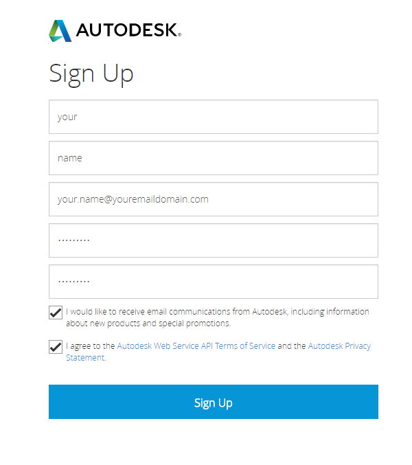
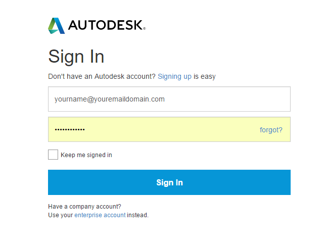
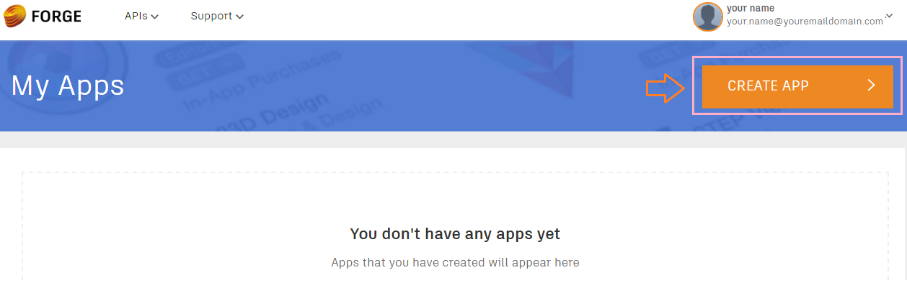
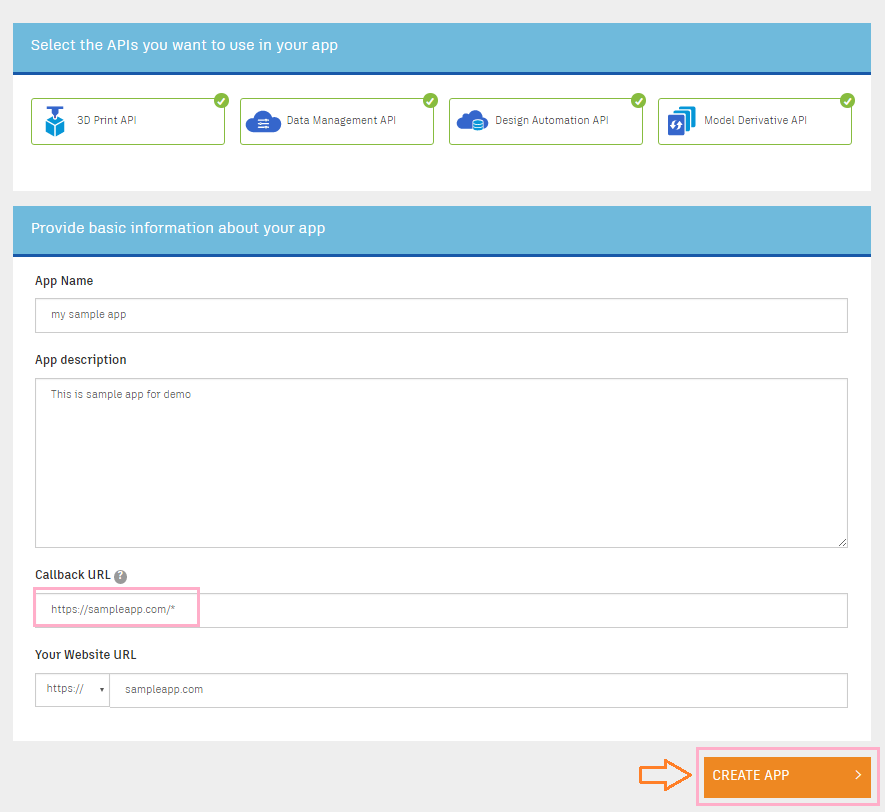
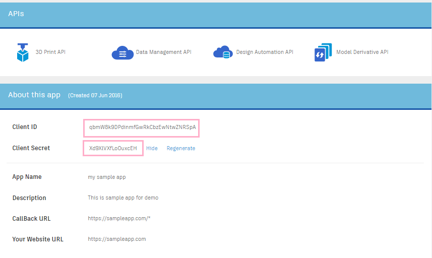

<a name="Chapter1"></a>
# Chapter 1 – Get ready with Model Derivative API

- [Create an App](#CreateAnApp)
- [Prepare a model](#PrepareAModel)


<a name="CreateAnApp"></a>
## Create an App

Before getting started with the Forge Platform, you need to set up an app and get your client ID and secret.

* Step 1: Log in to the Dev Portal
Go to the [Dev Portal](https://developer.autodesk.com/).



* If You Already Have an Autodesk Account

Click the “SIGN IN” button.
In the next “Sign In” screen, enter your email address and password, and click “Sign In” to log in to the Dev Portal.



* Step 2: Create an App
Once you’re signed in, you can create your application.



Click the “CREATE APP” button on the top-right in the “My Apps” page, in the next screen,



Select APIs you are going to use.
Enter your application name and description.
Enter a callback URL. Note that wildcards are allowed in the path (but not in the hostname). For more information, see the “callback URL” definition in [API Basics](https://developer.autodesk.com/en/docs/oauth/v2/overview/basics).

* Step 3: Note Your Client ID and Secret
Once you set up an application, you will see a Client ID and Client Secret in your newly created app page. You will need these in all other OAuth flows and, by extension, to complete every other tutorial on this site!



By default, a key can be used on any site and application. However, we strongly recommend that you restrict the use of your key to domains that you administer, to prevent
use on unauthorized sites. We also recommend you create a new App (API key) for every new application rather than reuse the same key in multiple applications.

If you want to learn more about OAuth 2 legged and 3 legged token, check out the rest of the [Step-by-Step guide](https://developer.autodesk.com/en/docs/oauth/v2/tutorials/).


<a name="PrepareAModel"></a>
## Prepare a model

Now you have your API key, the next step is to upload and translate a model so it can be displayed on a webpage for example.


### Upload a model on the Autodesk server

Upload one of your models to your account and get its URN using the following [web page](http://models.autodesk.io).

Alternatively, you can use one of the following desktop solutions instead if you prefer:

- [Node.js command line tool](https://github.com/Autodesk-Forge/forge.commandline-nodejs)
- [cUrl command line tool](https://github.com/Autodesk-Forge/forge.commandline-curl)

If you prefer using other programming languages or methods, there are even more samples in our
[GitHub collection](https://github.com/Developer-Autodesk)
and on the [developer page](http://developer-autodesk.github.io).

If you don't have your own model to work with, some 2D and 3D sample models are provided with this workshop, in the
[Sample files](
https://github.com/cyrillef/MIT-ARVR-Hackathon-Workshop/tree/master/Sample%20files) folder.

Each of these solutions will upload and translate models on your account which you can use and view later.


### Steps to translate a model using the [web page](http://models.autodesk.io).

1. Enter your Client Id and Client Secret, and press the 'Get my access token' button

2. Select one of the models from the 'samples' list. For example the 'Robot Arm' sample. Or Drag 'n Drop one of yours on the gray area. Then press the 'Translation this one for me' button.

3. You should see a progress bar in the 'Currently translating...' area, please give it some time, ...

4. Once the translation is over, You would see your model listed in the 'Ready"' section with the 'urn' that you need later. Make sure to copy and save that urn somewhere for later use.


<a name="CreateYourApp"></a>
## Get your App Ready!

For this tutorial, we'll create our pipeline using the Node.js command line tool which was clone'd with this project.

As a primary security concern, note that you should never sahre your client ID and secret with anyone. For this reason,
you do not want to save the keys in your project, nor to post them on github. We actually need these keys, only when we
generate an access token, so we will pass them as parameters when calling the command.

We already have the source downloaded on the machine, so we only need to install the dependencies.


### Download the sample node.js dependencies

Before you can run the sample, you need to download the node.js dependency modules used by the sample. You do this by executing the following command:
```
npm install
```

### Steps to translate a model using the tool

Put your client ID and secret in the placeholders below.

```
FORGE_CLIENT_ID=<client_id> FORGE_CLIENT_SECRET=<client_secret> node forge-cb.js 2legged
node forge-cb.js bucketCreate <unique-name>  ' something unique - to do only once
node forge-cb.js upload samples/wrench.f3d
node translate wrench.f3d
node translateProgress wrench.f3d  ' until is says success (complete)
node manifest wrench.f3d
node forge-cb.js html wrench.f3d wrench.html
```

If you are interrested to watch the html file produced, follow this instructions:

```
npm install -h http-server  ' you need to run this command only once per machine
http-server .
```

Start your browser and go to [http://localhost:8080/wrench.html](http://localhost:8080/wrench.html)


=========================
[Next](chapter-2.md#Chapter2) -
[Home](../README.md)
